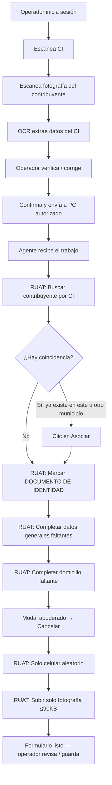

# PRD — Digitalizador (FormFlow Pro)

| Campo | Valor |
|---|---|
| **Producto** | Digitalizador |
| **Código / repo** | formflow-pro |
| **Versión del PRD** | 2.2 |
| **Fecha** | 11 agosto 2026 |
| **Estado** | MVP web + API + agente Windows listos; calibración selectores RUAT y prueba e2e pendientes |
| **Tipo** | App móvil/web + backend + agente de escritorio |

---

## 1. Resumen ejecutivo

Digitalizador permite a un operador escanear un documento de identidad desde el celular, extraer los datos con OCR/IA, verificarlos y enviarlos a un PC autorizado. Un agente de escritorio en ese PC completa el formulario del sistema empresarial en Firefox, sin modificar dicho sistema.

**Métrica objetivo:** pasar de ~10 minutos a **menos de 60 segundos** por registro.

---

## 2. Problema

Hoy el operador lee el documento a mano y digita los datos en el sistema empresarial. Eso implica:

- Tiempo alto por registro (~10 min)
- Errores de digitación
- Fatiga y baja productividad
- Revisiones constantes

El sistema empresarial no se puede modificar y suele estar restringido por IP corporativa; por eso la automatización debe ocurrir **desde el PC autorizado**, no desde el celular.

---

## 3. Solución

Tres componentes:

```
📱 Celular (PWA/web)     →  captura + OCR + verificación
☁️ Backend (Supabase)    →  auth, datos, storage, cola
💻 Agente Windows        →  recibe datos y automatiza Firefox
🦊 Sistema empresarial   →  sin cambios; se usa la sesión ya abierta
```

El operador siempre valida antes de enviar. En MVP, el agente **completa el formulario pero no guarda** automáticamente (modo seguro).

---

## 4. Usuarios y permisos

| Rol | Puede |
|---|---|
| **Operador** | Escanear, editar datos, confirmar/enviar a PC, ver historial y estado, ver errores |
| **Administrador** | Todo lo del operador + administrar PCs (token/activo), promover roles, ver historial global |

Regla actual: el **primer usuario** del sistema recibe `admin`; todos reciben también `operador`.

---

## 5. Alcance del MVP

### Incluido (objetivo MVP)

1. Login / registro (email + Google)
2. Escaneo con cámara + controles de calidad (nitidez / luz)
3. OCR/IA → 9 campos estructurados
4. Pantalla de verificación con confianza por campo
5. Envío a PC autorizado
6. API pública para el agente (`pendientes` / `resultado`)
7. Historial básico y logs de operación
8. Panel admin de computadores y tokens
9. Modo seguro: automatizar hasta “formulario listo”, sin guardar solo

### Fuera de MVP (Fase 2)

- Guardado automático en el sistema empresarial
- Detección real de bordes del documento
- Borrado automático de imágenes por TTL
- Estadísticas, cola avanzada, reintentos, notificaciones push
- Configuración dinámica de campos desde admin
- Edición completa de perfil
- App nativa / PWA instalable con service worker

### Bloqueante pendiente

- **Agente Windows (Digitalizador Agent)** — no está en este repositorio
- **Mapeo técnico del formulario Firefox** — requiere capturas reales del sistema empresarial

---

## 6. Datos a extraer (v1)

| Campo | Clave | Tipo | Notas |
|---|---|---|---|
| Número de documento | `numero_documento` | texto | Obligatorio para envío |
| Nombres | `nombres` | texto | |
| Apellidos | `apellidos` | texto | |
| Género | `genero` | select | MASCULINO / FEMENINO |
| Estado civil | `estado_civil` | select | SOLTERO / CASADO / DIVORCIADO / VIUDO |
| Fecha de nacimiento | `fecha_nacimiento` | texto | |
| Barrio | `barrio` | texto | Puede no estar en el CI |
| Avenida | `avenida` | texto | Puede no estar en el CI |
| Número de puerta | `numero_puerta` | texto | Puede no estar en el CI |

Cada campo lleva score de confianza (`confianza` jsonb). Umbrales UI:

- ≥ 0.85 → OK
- ≥ 0.6 → advertencia
- &lt; 0.6 → requiere revisión

---

## 7. Estados del documento

```
capturado → procesando → datos_extraidos → pendiente_revision
    → confirmado → enviado_pc → formulario_completado → registrado
```

Errores / cancelación: `error_ocr` | `error_conexion` | `error_automatizacion` | `error_sistema` | `cancelado`

---

## 8. Flujos principales

### 8.1 Flujo end-to-end (operador → RUAT)



### 8.2 Operador (app)

1. Inicia sesión → `/inicio`
2. Escanea **documento de identidad**
3. Escanea **fotografía** del contribuyente
4. OCR sobre el CI → datos estructurados
5. Revisa/edita en `/verificar/$id`
6. Elige PC autorizado y confirma
7. Espera estados del agente (polling)
8. Consulta historial / perfil

### 8.3 Administrador

1. Registra PC (`nombre`, `codigo`)
2. Copia / rota `agent_token`
3. Activa o desactiva PCs
4. Asigna rol admin a operadores

### 8.4 Agente (contrato HTTP)

| Método | Ruta | Auth | Comportamiento |
|---|---|---|---|
| GET | `/api/public/agente/pendientes` | header `x-agent-token` | Docs `confirmado` del PC → marca `enviado_pc` |
| POST | `/api/public/agente/resultado` | header `x-agent-token` | Reporta `formulario_completado`, `registrado` o errores |

---

## 9. Requisitos funcionales

| ID | Requisito | Estado actual |
|---|---|---|
| RF-01 | Capturar foto del documento desde celular | ✅ Implementado |
| RF-02 | Procesar imagen con OCR/IA | ✅ Implementado |
| RF-03 | Identificar campos definidos | ✅ Implementado |
| RF-04 | Permitir editar datos detectados | ✅ Implementado |
| RF-05 | Validar antes de enviar (campos + PC) | ✅ Parcial (validación básica) |
| RF-06 | Enviar al PC autorizado | ✅ Implementado (estado + cola) |
| RF-07 | Agente recibe datos | 🟡 API lista; agente no existe |
| RF-08 | Agente interactúa con Firefox | ❌ Pendiente |
| RF-09 | Agente completa campos | ❌ Pendiente |
| RF-10 | Informar resultado de automatización | 🟡 API lista; sin agente |
| RF-11 | Mantener historial | ✅ Implementado |
| RF-12 | Controlar usuarios y PCs | ✅ Implementado (admin básico) |
| RF-13 | Destacar baja confianza | ✅ Implementado |
| RF-14 | Logs de operación | ✅ Implementado |
| RF-15 | Detección de bordes del documento | ❌ Pendiente (solo nitidez/luz) |
| RF-16 | Borrado automático de imágenes | ❌ Pendiente |

---

## 10. Requisitos no funcionales

| Área | Objetivo |
|---|---|
| **Rendimiento OCR** | Ideal 2–10 s |
| **Rendimiento automatización** | Ideal 2–10 s (depende del sistema empresarial) |
| **Ciclo total** | &lt; 60 s por registro |
| **Disponibilidad** | Jornada laboral continua |
| **Seguridad** | HTTPS, auth de usuarios, tokens de agente, RLS, sin guardar passwords del sistema empresarial |
| **Usabilidad** | Flujo: escanear → revisar → confirmar |
| **Privacidad** | Minimizar retención de imágenes; borrado automático en Fase 2 |
| **Diseño** | UI profesional, mobile-first, marca Digitalizador |

---

## 11. Arquitectura técnica (estado real)

| Capa | Tecnología |
|---|---|
| Frontend / SSR | TanStack Start + React 19 + Vite + Tailwind 4 + shadcn/ui |
| Auth | Supabase Auth + Lovable Cloud Auth (Google) |
| Datos | Supabase Postgres + RLS |
| Storage | Bucket `documentos` (path `{userId}/...`) |
| OCR | Server function → Google Gemini API (`GEMINI_API_KEY`) |
| Hosting | Vercel + Supabase (sin Lovable Cloud) |
| API agente | Rutas públicas TanStack Start |
| Agente desktop | **No en repo** (C#/.NET o Python a definir) |

### Entidades principales

- `profiles`, `user_roles` (`admin` \| `operador`)
- `computers` (`codigo`, `agent_token`, `activo`, `last_seen_at`)
- `documents` (campos CI + `confianza` + timings + estados)
- `operation_logs` (auditoría por evento)

---

## 12. Pantallas (app)

| Ruta | Propósito |
|---|---|
| `/` | Landing de producto |
| `/auth` | Login / registro |
| `/inicio` | Dashboard operador |
| `/escanear` | Cámara + captura + OCR |
| `/verificar/$id` | Edición, confianza, envío a PC |
| `/historial` | Lista filtrable |
| `/perfil` | Sesión + actividad |
| `/admin` | PCs, tokens, roles |

---

## 13. Seguridad

- Autenticación de operadores/admins
- RLS en tablas sensibles
- `agent_token` no expuesto a clientes autenticados (solo server/admin)
- Comunicación HTTPS
- El agente trabaja sobre la sesión ya abierta del operador en Firefox
- El agente **no** almacena credenciales del sistema empresarial
- La restricción por IP del sistema empresarial se respeta (tráfico sale del PC autorizado)

---

## 14. Criterios de éxito

El proyecto se considera exitoso cuando:

1. **Tiempo:** registro típico &lt; 1 minuto
2. **Precisión:** alta extracción + revisión humana antes de enviar
3. **Automatización:** formulario empresarial completado sin digitación manual
4. **Confiabilidad:** enlace estable celular → servidor → PC → Firefox
5. **Seguridad:** sin filtración de tokens/imágenes/datos personales

---

## 15. Roadmap

### Fase 1 — MVP end-to-end (ahora)

- [x] App operador (inicio, escanear, verificar, historial, perfil)
- [x] OCR + confianza
- [x] Captura CI + fotografía (compresión ≤ 90 KB)
- [x] Admin de PCs y tokens
- [x] API agente (incluye foto_url, apellidos partidos, celular aleatorio, instrucciones RUAT)
- [x] Scaffold Agente Windows (`agent/`) con flujo RUAT
- [x] Conectar agente a sesión Firefox (perfil persistente + CDP opcional)
- [x] Selectores externos (`agent/selectors.json`) para calibrar sin tocar código
- [ ] Ajustar `selectors.json` al HTML real del municipio
- [ ] Pruebas end-to-end en PC autorizado

### Fase 2 — Operación

- Guardado automático en RUAT (`GRABAR_AUTOMATICO=1` en el agente)
- Detección de bordes / mejor captura
- Cola, reintentos, notificaciones
- Estadísticas y panel avanzado
- Retención/borrado de imágenes
- Configuración de campos
- PWA offline/resiliente

### Fase 3 — Escala

- Múltiples sedes / muchos PCs
- Observabilidad (latencia OCR, tasa de error, SLA)
- Hardening de seguridad y compliance

---

## 16. Flujo RUAT — Registro Contribuyente Natural (definitivo)

Sistema objetivo: **Registro Contribuyente Natural** (RUAT) en Firefox.  
Sesión del operador ya abierta en el PC autorizado.

### A. Capturas en el celular

| # | Captura | Destino |
|---|---|---|
| 1 | Documento de identidad | OCR → datos del registro |
| 2 | Fotografía del contribuyente | Paso final de imágenes RUAT (máx. **90 KB**) |

### B. Automatización en Firefox (paso a paso)

| Paso | Pantalla RUAT | Acción del agente |
|---|---|---|
| 1 | Menú principal | `REGISTRO CONTRIBUYENTES` → **Contribuyente Natural** |
| 2 | Buscar Contribuyente | Nº documento (OCR) · Tipo = `CEDULA DE IDENTIDAD` · **Departamento expedido = en blanco** · **Buscar** |
| 2b | Resultado de búsqueda | **Si hay coincidencia** (contribuyente ya registrado en el mismo u otro municipio) → clic en **Asociar** y continuar con el llenado de lo que falte. **Si no hay coincidencia** → seguir el alta nueva normal |
| 3 | Recepcionar Documentación | Marcar solo **DOCUMENTO DE IDENTIDAD** · **Grabar** *(sin Gestor Trámite: ya no existe)* |
| 4 | Datos Generales | Completar lo faltante: nombre(s), apellidos, género, estado civil, fecha nacimiento · **Departamento expedido = en blanco** · **Aceptar** |
| 5 | Domicilio Legal | Completar lo faltante: zona/barrio, tipo/nombre lugar, nº puerta · **Aceptar** |
| 6 | Modal Apoderado | **Siempre Cancelar** *(no es el Asociar del contribuyente)* |
| 7 | Información Adicional | Solo **Teléfono Celular** aleatorio (ej. `78956525`) · resto vacío · continuar |
| 8 | Registrar Imágenes | Subir **solo Fotografía** (≤ 90 KB) · **no** anverso · **no** reverso · **Aceptar** |
| 9 | Fin MVP | Dejar listo para que el operador revise y guarde (modo seguro) |

### C. Rama especial: contribuyente ya existente

Cuando al buscar el CI el sistema muestra una coincidencia:

1. Clic en **Asociar**
2. El registro queda vinculado (mismo u otro municipio)
3. Continuar el flujo y **llenar solo lo que falte** (datos generales, domicilio, celular, fotografía, etc.)

### D. Reglas fijas (no negociables en MVP)

- No usar **Gestor Trámite**
- **Departamento expedido** siempre en blanco
- Si hay coincidencia del CI → **Asociar** y completar faltantes
- Modal apoderado: **siempre Cancelar**
- Información adicional: **solo celular aleatorio**
- Imágenes: **solo la fotografía**

---

## 17. Decisiones cerradas / abiertas

### Cerradas

1. Agente: **Python + Playwright**
2. Firefox: perfil **persistente** (default) o **CDP** (`connect_cdp`)
3. Celular: aleatorio 8 dígitos empezando en 6 o 7 (API `pendientes`)
4. Compresión foto ≤ 90 KB: **en el celular** (`image-compress.ts`)
5. Registro público: **deshabilitado en UI**; cuentas solo por admin
6. **Grabar en RUAT:** MVP = operador; **Fase 2 = agente** (`GRABAR_AUTOMATICO=1`)

### Abiertas

1. Ajuste fino del recorte de foto si el default de RUAT falla
2. Política de retención de imágenes (TTL exacto)

---

## 18. Fuera de alcance explícito

- Modificar el sistema empresarial
- Bypass de restricción de IP
- Sustituir la validación humana en el MVP
- App de tiendas (iOS/Android nativa) en Fase 1

---

## 19. Glosario

| Término | Significado |
|---|---|
| Digitalizador | Nombre de producto (UI) |
| FormFlow Pro | Nombre del repositorio / proyecto |
| Agente | Programa Windows que habla con la API y controla Firefox |
| PC autorizado | Computador registrado con token de agente |
| Confianza | Score 0–1 por campo OCR |
| Modo seguro | Completa el formulario; el operador guarda a mano |
